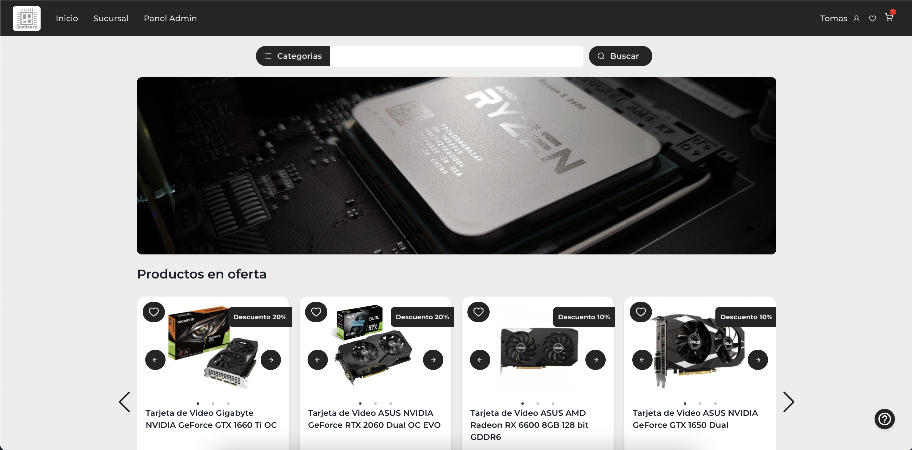
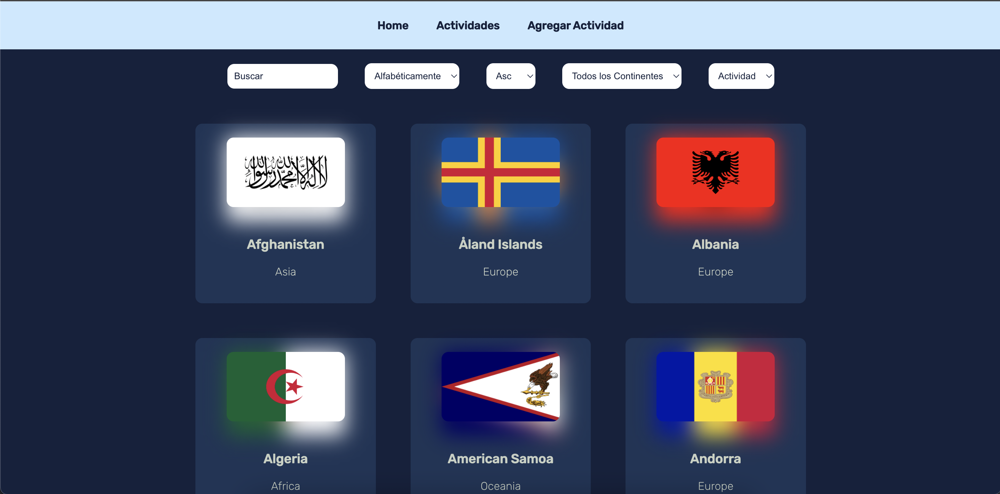
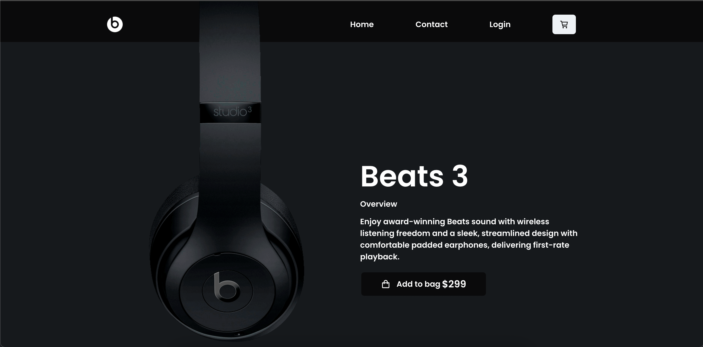
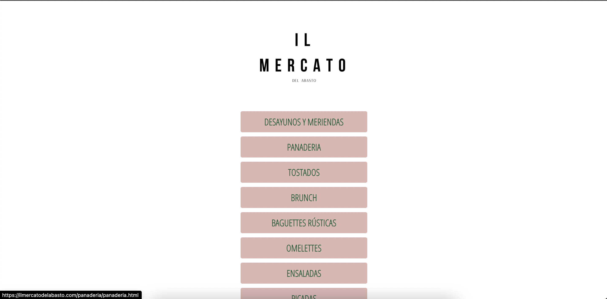
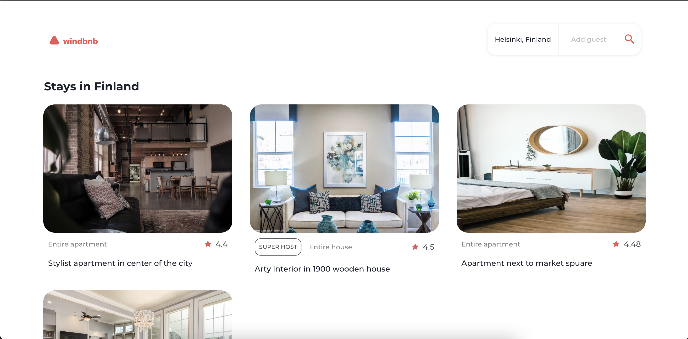
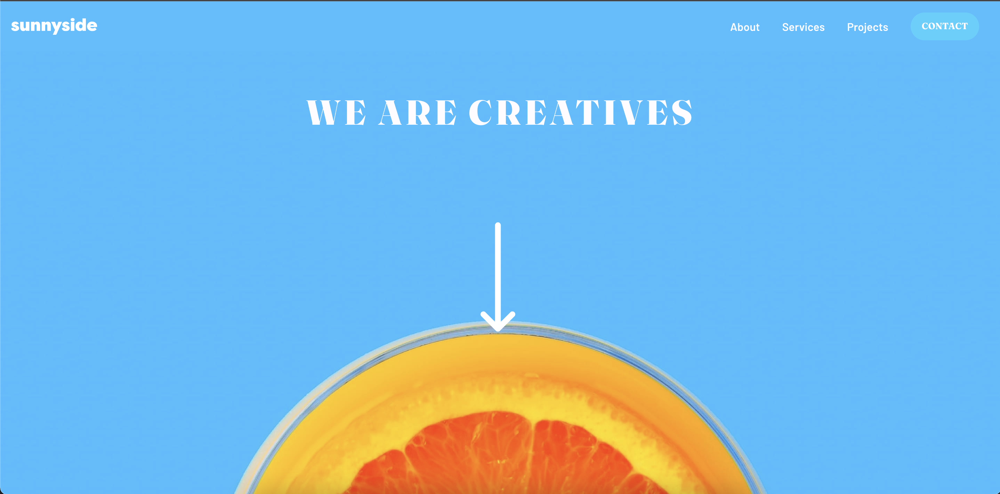

# Hola, soy Tom 👋🏼

- 🔭 En que estoy trabajando [E-commerce](https://e-commerce-pf.vercel.app/)

- 🌱 Estoy aprendiendo React e ingles

- 👨‍💻 Todos mis proyectos los podes encontrar en [My projects](https://github.com/Tomashanahan?tab=repositories)

- 💬 Preguntame cosas sobre JavaScript, TypeScript, NodeJS, React, React-TypeScript, HTML, CSS, Tailwindcss, Bootstrap, Jest-test-react, Redux, Express-validador, Express, PostgreSQL, OAuth,  Sequelize, Json Web Tokens,  MogonDB

- 📫 Como encontrarme tshmg@gmail.com

##

<h1>Proyectos</h1>
<ul>
  <ol align='center'>
      
      &nbsp&nbsp&nbsp&nbsp&nbsp
      
  </ol>
  <ol align='center'>
     
    
    &nbsp&nbsp&nbsp&nbsp&nbsp
    
  </ol>
  <ol align='center'>
     
    
    &nbsp&nbsp&nbsp&nbsp&nbsp
    
  </ol>
</ul>

 
<h1>Tecnologias</h1>

  
  
  
  
  
  
  

 

 

<h1>Datos de Contacto</h1>
<ul>
  <ol><a target='blank' href="https://www.linkedin.com/in/tomas-shanahan">Linkedin</a></ol>
  <ol><a href="mailto:tshmg@hotmail.com">Mail</a></ol>
</ul>
